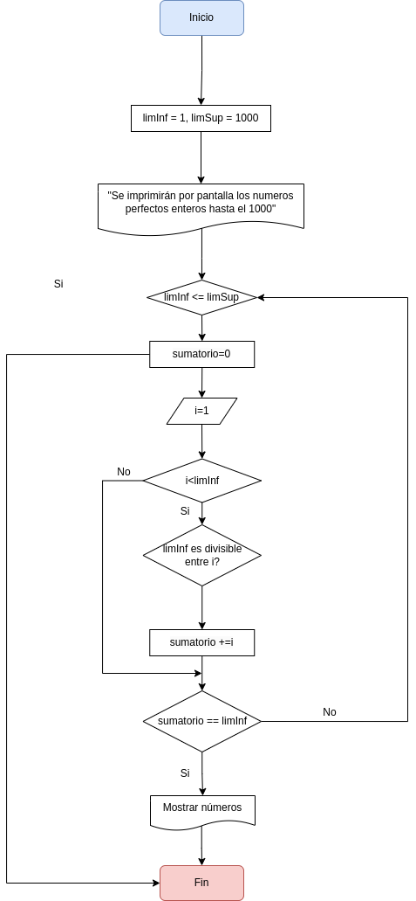

# Tarea 2

Hecho por: __Pedro Martín Escuela__

- [Descripcion](#descripcion)
- [Diagrama](#diagrama)
- [Pseudocodigo](#pseudocodigo)

## Descripcion 

El ejercicio consiste en escribir un programa que encuentre e imprima todos los números perfectos en un rango dado (por ejemplo, entre 1 y 1000).

 

## Diagrama 

 

 

## Pseudocodigo 

- Inicio

- Declaración de variables:

- __limSup = 1000__, __limInf = 1__

- Imprimimos por pantalla que se calcularán los __números perfectos enteros__ del __1__ al __1000__

- Iniciamos un __bucle__ el cual se irá repitiendo hasta que comprobemos todos los números entre __1__ y __1000__

- Declaramos la __variable sumatorio__ que servirá como __contador__, aquí dentro. Si estuviera fuera, no podríamos reutilizarla ya que el valor inicial nunca volvería a ser __0__

- Iniciamos un __bucle__ en el cual comprobamos los numeros que son __divisibles__ entre el numero actual que estamos comprobando y si es así lo añadimos al contador llamado "__sumatorio__"

- Damos una opción de __salida del bucle__, con la __condición__ de que los __números sumados__ sean igual al numero actual del __limInf__

- El valor del __limInf aumenta__, para iniciar el siguiente bucle con el número siguiente

- El programa acabará cuando llegue a __1000__

- Fin

